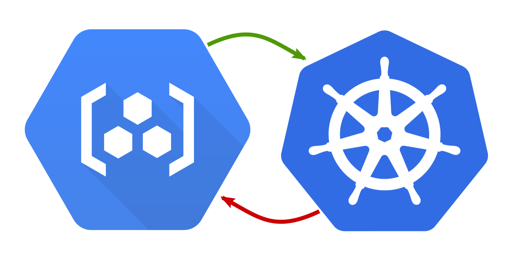

# k8s-gcr-auth-helper



  [](https://crates.io/crates/k8s-gcr-auth-helper) [](https://crates.io/crates/k8s-gcr-auth-helper) [](https://hub.docker.com/r/stephenc/k8s-gcr-auth-helper/) 

A Kubernetes authentication helper to expose per-user credentials as Image Pull Secrets for Google Container Registry.

## Why would you need this?

If you have private container images stored in Google Container Registry but you want to test them using a local Kubernetes cluster, e.g. [k3d](https://github.com/rancher/k3d)/[k3s](https://github.com/rancher/k3s) or [minikube](https://kubernetes.io/docs/tasks/tools/install-minikube/) you will need to provide the authentication details to your local Kubernetes cluster.

If you do not have the permissions to create a service account in Google Cloud, you will have to use short-lived (1h) access tokens.
Updating the secret every hour gets annoying real fast.

This helper automates away the problem.

## Install

Pre-built binaries are available from the [GitHub Releases](https://github.com/stephenc/k8s-gcr-auth-helper/releases).

OS-X Homebrew package is available from [stephenc/stable](https://github.com/stephenc/homebrew-stable): `brew install stephenc/stable/k8s-gcr-auth-helper`

All other platforms can build from source using [Cargo](https://doc.rust-lang.org/cargo/getting-started/installation.html)

## Build

```
cargo install k8s-gcr-auth-helper
```

*NOTE:* On Windows, if you are having trouble building with native TLS you can switch to rustls, e.g.

```
cargo install k8s-gcr-auth-helper --no-default-features --features rustls-tls
```                                                   

## Testing

The docker image also needs to be built and available to your Kubernetes cluster if you want to use the `add` mode. For example to test your local changes using k3d

```                        
# set up a cluster to test with
k3d create --name auth-test
export KUBECONFIG=$(k3d get-kubeconfig --name auth-test)

# build the controller image with local changes (do not use :latest as that will pull Always)
docker build --tag k8s-gcr-auth-helper:local .                                               

# run the local changes helper
cargo run -- add --controller-image k8s-gcr-auth-helper:local --service-account default gcr-secret

# now deploy your services into k3d that use a GCR hosted image

# when done, so you can try again
cargo run -- remove --service-account default gcr-secret

# when really done
k3d delete --name auth-test
```

## Use

### I don't mind my refresh token being stored in my cluster

To install in the current namespace of your current Kubernetes cluster:

```
k8s-gcr-auth-helper add gcr-pull-secret-name
```                                                                    

To install and add to the default service account

```
k8s-gcr-auth-helper add --service-account default gcr-pull-secret-name
```                                                                    

To install and add to the all service accounts in the namespace

```
k8s-gcr-auth-helper add --all-service-accounts gcr-pull-secret-name
```                                                                    

*NOTE:* You can specify multiple `--service-account` arguments to install in multiple service accounts. To install in multiple namespaces run the command multiple times (with `--namespace` if you want to avoid changing namespace)

The first time the command is run it will open a browser to get an OAuth2 refresh token which will be stored in the cluster. 
A refresh service deployment will be created that listens for auth failures and refreshes the access token secret as required.

To remove use the same command with `add` replaced by `remove`, e.g.:

```
k8s-gcr-auth-helper remove gcr-pull-secret-name
```     

*NOTE:* If you have manually added an `imagePullSecrets` reference to additional service accounts you can specify them with `--service-account ...` or you can just purge the secret reference from all accounts with `--all-service-accounts`. If you forget you can always edit the service accounts manually. 

### I'm paranoid

Paranoid mode assumes you have `gcloud` configured and authenticated.

```
k8s-gcr-auth-helper gcloud gcr-pull-secret-name
``` 

This will run a slightly different version of the refresh service *locally in your terminal*.
While the process is running, any auth failures will be processed by requesting a new access token by forking the request to your locally installed `gcloud` program.
As soon as you terminate the process, the updates will stop and the access token in the cluster will have expired in at most 1 hour.
